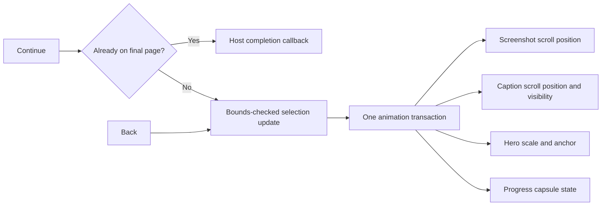

# iOS 26 onboarding style — reusable SwiftUI reference

Study date: 23 September 2026. Status: tutorial study and design reference. Lite now has an implementation; see [current behavior and implementation notes](ONBOARDING.md).

Reference: Kavsoft, [New iOS 26 Style OnBoarding Animation Using SwiftUI | Complex Animations | Xcode 26](https://www.youtube.com/watch?v=IoLPClPxgsY), 17:00, published 19 February 2026. The video description lists Xcode 26.3 and macOS 26.3. The author’s downloadable project is linked from [Patreon](https://www.patreon.com/posts/new-ios-26-style-151176681).

## How to use this document

Use this as a handoff for a future implementation: reproduce the composition and synchronized motion first, then substitute the destination app’s screenshots, copy, theme, and completion action. Keep the motion component independent from first-launch persistence and app navigation.

Evidence labels:

- **Observed:** visible in the demonstration or code frames inspected across the tutorial’s beginning, middle, and ending. Timestamps below are inspection points, not official chapters.
- **Recommended:** production adaptations proposed here, including accessibility, empty-data handling, adaptive sizing, and Lite integration.
- **Unverified:** the downloadable project was not accessed or built. There is no YouTube transcript. This is a visual/code-frame study across the full timeline, not a line-by-line audit of the complete source or frame-by-frame timing measurement. The automated scene-analysis job had not returned results and was not used as evidence.

The snippets below explain an independently structured implementation. They are partial integration examples, not a replacement distribution of the author’s project, and have not been compiled as an onboarding component.

## 1. What defines the style

**Observed:** a dark, full-screen presentation contains one dominant phone-shaped preview above a compact caption area. A circular back control sits at the top leading edge. A small capsule page indicator and a wide tinted Continue button stay near the bottom.

Advancing a page coordinates several changes:

1. The screenshot strip moves horizontally inside a shared phone-shaped viewport.
2. The whole preview scales around a page-specific anchor, directing attention to part of the screenshot.
3. The caption strip moves horizontally; outgoing copy fades and blurs, while incoming copy sharpens and appears.
4. The active progress capsule moves through the row by changing the capsules’ widths and opacity.
5. On zoomed pages, a blurred glass surface behind the lower content helps separate the copy from the enlarged preview.

The signature is continuity: the preview, caption, progress, and controls remain parts of one composition. The inspected implementation uses synchronized scroll positions and a scale effect; a matched-geometry transition, 3D rotation, custom shader, or keyframe animator is not needed to explain the observed effect.

The colorful desktop wallpaper, outer device mockup, creator watermark, and sponsorship graphics surrounding the demonstration are video presentation elements. They are not the onboarding view’s background or controls.

## 2. Video/code study map

| Inspection point | What is visible | Implementation lesson |
| --- | --- | --- |
| [0:10](https://www.youtube.com/watch?v=IoLPClPxgsY&t=10s) | Screenshot transition into a fitness screen; blurred caption; stationary bottom CTA | Coordinate screenshot movement and caption disappearance |
| [0:15](https://www.youtube.com/watch?v=IoLPClPxgsY&t=15s) | Enlarged Photos preview extends toward the lower content, with blur behind copy | Zoom belongs to the hero; protect foreground readability |
| [0:25](https://www.youtube.com/watch?v=IoLPClPxgsY&t=25s) | Safari/context-menu example | Each item is a screenshot plus explanatory copy, not a live embedded app |
| [1:42](https://www.youtube.com/watch?v=IoLPClPxgsY&t=102s) | `iOS26StyleOnBoarding`, tint, items, bottom-aligned root, `Item` fields | One reusable presentation component driven by data |
| [3:24](https://www.youtube.com/watch?v=IoLPClPxgsY&t=204s) and [5:06](https://www.youtube.com/watch?v=IoLPClPxgsY&t=306s) | Progress capsules and active-index styling | Progress derives from the same index as content |
| [5:16](https://www.youtube.com/watch?v=IoLPClPxgsY&t=316s) | Shared spring configuration | Duration 0.65, bounce 0, initial velocity 0 |
| [6:48](https://www.youtube.com/watch?v=IoLPClPxgsY&t=408s) | Horizontal caption scroll view, full-width text pages, blur and opacity | Text uses spatial movement plus a clarity transition |
| [8:30](https://www.youtube.com/watch?v=IoLPClPxgsY&t=510s) | Horizontal screenshot strip, target layout, disabled scrolling | Buttons drive the sequence programmatically |
| [10:12](https://www.youtube.com/watch?v=IoLPClPxgsY&t=612s) | Aspect-fit image measurement and optional-image fallback | Derive the visible device bounds from fitted screenshot size |
| [11:54](https://www.youtube.com/watch?v=IoLPClPxgsY&t=714s) | Device outline over the screenshot viewport | Keep the frame separate from the scrolling images |
| [12:46](https://www.youtube.com/watch?v=IoLPClPxgsY&t=766s)–[13:36](https://www.youtube.com/watch?v=IoLPClPxgsY&t=816s) | Hero scale, layout insets, item zoom configuration, concentric clipping | Modifier order and zoom anchor are central to the effect |
| [15:18](https://www.youtube.com/watch?v=IoLPClPxgsY&t=918s) | `VariableGlassBlur`, conditional opacity, corner-radius calculation | Lower-content separation is conditional on zoom |
| [15:58](https://www.youtube.com/watch?v=IoLPClPxgsY&t=958s) | Continue/Get Started label, clamped increment, completion call | Completion is a callback supplied by the host |
| [16:28](https://www.youtube.com/watch?v=IoLPClPxgsY&t=988s) | Final layered bezel strokes and `hideBezels` condition | The frame is optional presentation styling |
| [16:48](https://www.youtube.com/watch?v=IoLPClPxgsY&t=1008s) | Orange tint, hidden bezels, five sample items, completion closure | Public configuration supports reuse without changing transition code |

## 3. Screen anatomy and layering

Conceptual hierarchy, reconstructed from the inspected code:

```text
Onboarding root — ZStack aligned to bottom
├── Screenshot hero
│   ├── Black backing
│   ├── Horizontal screenshot strip
│   │   └── Aspect-fit screenshot or fallback per page
│   ├── Shared rounded viewport clip
│   └── Optional layered device bezel
│   [composite, then apply current page's scale + anchor]
├── Lower content stack
│   ├── Caption strip: title + subtitle
│   ├── Progress capsules
│   └── Continue / Get Started
│   [glass/blur separation for enlarged hero content]
└── Back control
```

**Observed layout constants:** these are tutorial values, not requirements for every phone size.

| Token | Tutorial value | Role |
| --- | --- | --- |
| Root alignment | Bottom | Keeps the lower stack anchored |
| Color scheme | Forced dark | Black stage, light copy and progress |
| Hero insets | Top 35, horizontal 30, bottom 220 pt | Reserves space for navigation and lower content |
| Lower stack | Spacing 10; top padding 20; horizontal padding 15; height 210 pt | Caption/progress/button region |
| Caption title/subtitle spacing | 6 pt | Compact text grouping |
| Screenshot strip spacing | 12 pt | Gap visible during horizontal transitions |
| Caption strip spacing | 0 pt | Full viewport-width text pages |
| Progress spacing | 6 pt | Small, centered row |
| Progress dimensions | Active 25 × 6; inactive 6 × 6 pt | Elongated active capsule |
| Progress opacity | Active 1; inactive 0.4 | Reinforces active position |
| Progress bottom padding | 5 pt | Separates dots from CTA |
| CTA horizontal padding | 30 pt inside its container | Broad capsule with inset edges |
| CTA label vertical padding | 6 pt | Added to the system button style’s sizing |

**Recommended:** use a measured lower region or `safeAreaInset(edge: .bottom)` instead of assuming 210/220 pt always fits. Let longer text grow and shrink the hero before clipping text or controls. Keep a minimum 44 × 44 pt target for Back and other interactive controls. For accessibility text sizes or short landscape windows, show a smaller static hero with vertically scrollable copy.

## 4. Data and ownership

**Observed component:** `iOS26StyleOnBoarding` takes items, a tint, an optional bezel-hiding setting, and an `onComplete` closure in the final example. Local state includes `currentIndex: Int = 0` and `screenshotSize: CGSize = .zero`.

| Observed item field | Type | Responsibility |
| --- | --- | --- |
| `id` | `Int` | Item identity |
| `title` | `String` | Main page message |
| `subtitle` | `String` | Short explanation |
| `screenshot` | `UIImage?` | Preview artwork; tutorial renders black if missing |
| `zoomScale` | `CGFloat`, default 1 | Hero magnification |
| `zoomAnchor` | `UnitPoint`, default center | Point around which hero scales |

The final sample supplies five items. One uses scale **1.3**, anchored at **bottom**. Another uses scale **1.2**, anchored at **(0.5, −0.1)**. The remaining shown examples use default zoom values. The negative vertical anchor sits above the view, which changes where the preview moves as it grows. These values are tied to the demonstrated assets; they are not universally suitable focus points.

The final code example repeats placeholder content while the opening demonstration uses different app screenshots. Keep demonstration content and reusable component logic separate when interpreting the tutorial.

**Recommended production contract:** give pages stable semantic IDs, localized copy, an asset identifier, and a zoom configuration. Keep completion state and product routing in the host. Do not infer a collection offset from an arbitrary item ID.

```swift
// Suggested model; independently named and structured for future reuse.
struct IntroPage: Identifiable {
    let id: String
    let title: LocalizedStringKey
    let message: LocalizedStringKey
    let imageName: String
    var scale: CGFloat = 1
    var anchor: UnitPoint = .center
}
```

Use an immutable page list during presentation. Validate that it is nonempty and IDs are unique before presenting. In development, flag missing artwork; in production, preserve useful copy and a deliberate placeholder instead of an unexplained black hole. If pages can change dynamically, reconcile selection before indexing.

## 5. Synchronizing the two strips

**Observed:** both screenshot and text scroll views read `currentIndex` through `scrollPosition(id:)`. Their binding setters ignore scroll feedback. The tutorial iterates over `items.indices`, so scroll identity corresponds to collection position. Screenshots use `scrollTargetLayout()`, `.viewAligned` targeting, hidden indicators, and `.scrollDisabled(true)`.

This is a button-controlled presentation. Swiping is not an established capability of this implementation. Removing `scrollDisabled` alone would leave state synchronization incomplete because the setters discard user-driven position changes.

**Recommended:** continue with one authoritative selection for a button-driven version. Both strips must use exactly the same identity scheme. If adding swipe support, make one strip the driver, synchronize the other from it, and define how incomplete drags affect caption clarity and progress.



For implementation, the final-page check belongs before any increment. Guard completion against repeated taps and return after calling the host. At the first page, Back should be disabled/hidden or have a documented exit action; never underflow the index.

## 6. Motion specification

**Observed animation setting:** an interpolating spring with **duration 0.65 seconds, bounce 0, initial velocity 0**. It is used by the page-changing animation transaction. Duration is the spring’s perceptual duration, not a measured assertion that every rendered frame settles at exactly 650 ms. Apple describes this distinction in the [interpolating spring API](https://developer.apple.com/documentation/swiftui/animation/interpolatingspring(duration:bounce:initialvelocity:)).

| Property | Before → after advancing | Coordination |
| --- | --- | --- |
| Screenshot position | Current page → adjacent page | Programmatic horizontal scrolling |
| Hero scale | Current item scale → next item scale | Same selection transaction |
| Hero anchor | Current item anchor → next item anchor | Page-specific focus; verify compound motion visually |
| Outgoing text opacity | 1 → 0 | Alongside text-strip movement |
| Incoming text opacity | 0 → 1 | Alongside text-strip movement |
| Outgoing text blur | 0 → 30 pt | Applied to composited title/subtitle group |
| Incoming text blur | 30 → 0 pt | Reveals readable new copy |
| Old/new progress widths | 25 → 6 / 6 → 25 pt | Same selection change |
| Old/new progress opacity | 1 → 0.4 / 0.4 → 1 | Same selection change |
| Lower glass visibility | Hidden at scale 1; shown at non-unit scale | Tied to current item’s zoom |
| CTA label | Continue → Get Started on last page | Tutorial applies a numeric-text content transition |

No independently measured property delays or separate back-navigation spring were established. Start with the shared spring shown in the tutorial; do not invent a stagger or reverse a fitted curve. Back should target the previous page’s full configuration.

**Recommended motion adapter:**

```swift
@Environment(\.accessibilityReduceMotion) private var reduceMotion

private var pageAnimation: Animation? {
    reduceMotion ? nil : .interpolatingSpring(
        duration: 0.65,
        bounce: 0,
        initialVelocity: 0
    )
}

// Use one transaction for all selection-derived visual state.
// Clamp/validate targetPosition before reaching this statement.
withAnimation(pageAnimation) {
    selectedPosition = targetPosition
}
```

For Reduce Motion, also set the displayed hero scale to 1 and text blur to 0. Merely removing the animation while retaining large anchor jumps still produces a disorienting composition change. Keep page meaning and navigation identical.

## 7. Screenshot geometry, clipping, and bezel

**Observed:** a resizable image uses aspect-fit sizing. `onGeometryChange(for: CGSize.self)` captures the fitted image’s displayed dimensions. The viewport constrains its maximum dimensions to that measured size when nonzero; nil constraints avoid an initial zero-size collapse.

The tutorial’s radius calculation scales an asset-space value of **190** by `displayedScreenshotHeight / sourceImageHeight`, using the first item’s image size. This is an asset calibration constant, not a measured hardware corner radius or universal iPhone value.

A `ConcentricRectangle(corners: .concentric, isUniform: true)` shapes the preview; a surrounding `containerShape(RoundedRectangle(...))` supplies corner context. The final screenshot strip is clipped before its frame overlay. Individual images also receive clipping during the tutorial.

The final inspected bezel overlay contains three strokes: white at 6 pt, black at 4 pt, and black at 6 pt with 4 pt padding; the stack has −6 pt padding. It is rendered only after a nonzero measurement and when bezels are enabled.

**Modifier-order rule:** fit and measure the screenshot, establish the viewport, clip the screenshot strip, draw its frame, then composite and scale the assembled hero. Keep caption, progress, and CTA outside that scale operation. Scaling the entire root would enlarge the button and move its hit target.

**Recommended asset rules:**

- Use consistent screenshot aspect ratios, dimensions, and status-bar treatment across a sequence.
- Include only the screen content in the asset when adding a synthetic bezel. Avoid double phone frames or duplicated islands.
- Use bundled, predecoded/downsampled assets sized for their rendered resolution and maximum zoom. Do not download artwork during each transition.
- Store aspect ratio and corner calibration as explicit theme/asset metadata if supporting different devices.
- Prefer one deterministic fitted-size calculation or one designated measurement source. Multiple unequal screenshots writing shared `screenshotSize` can produce viewport jumps.
- Treat zero height, a missing first screenshot, orientation changes, and a new container size as explicit cases.

## 8. Glass and blur treatment

**Observed:** `VariableGlassBlur` builds a transparent rectangle with a clear glass effect tinted black at 0.5 opacity, applies a supplied blur radius, expands horizontal and bottom bounds by twice that radius using negative padding, and ignores safe areas. Its opacity is conditional on the current page’s scale differing from 1.

The inspected helper establishes the mechanism; the exact call-site blur radius and any final masking were not verified. Do not describe this as a measured variable-radius shader. It is a blurred glass surface whose bounds and visibility are configured in SwiftUI.

**Recommended:** put this decorative separator behind the lower controls, disable its hit testing, and hide it from accessibility. Use an opaque or translucent dark surface with a gentle fade when Reduce Transparency is enabled. Profile the 30 pt caption blur and glass combination on device; simplify the separator before sacrificing text readability or responsiveness.

## 9. iOS compatibility

Lite’s app and test targets currently specify iOS **17.0** in `lite.xcodeproj/project.pbxproj`. The tutorial’s newest visual APIs must be guarded rather than raising that target implicitly.

| Mechanism | Future Lite implementation |
| --- | --- |
| Programmatic scroll identity | Use the iOS 17 [`scrollPosition(id:anchor:)`](https://developer.apple.com/documentation/swiftui/view/scrollposition(id:anchor:)) family with explicit target identities |
| Screenshot measurement | The single-new-value [`onGeometryChange`](https://developer.apple.com/documentation/swiftui/view/ongeometrychange(for:of:action:)) overload is back-deployed to iOS 16 with a supporting SDK; avoid assuming all overloads have that availability |
| Concentric preview corners | [`ConcentricRectangle`](https://developer.apple.com/documentation/swiftui/concentricrectangle) is iOS 26+; use a continuous `RoundedRectangle` below 26 |
| Glass surface | [`glassEffect`](https://developer.apple.com/documentation/swiftui/view/glasseffect(_:in:)) is iOS 26+; use material/gradient or a solid surface below 26 |
| Glass CTA and flexible button sizing | Keep the tutorial’s `.glassProminent` / `.buttonSizing(.flexible)` branch on iOS 26; use a full-width bordered-prominent capsule fallback below 26 |
| Motion | Keep the same page model and state transitions in both visual branches |

Use `if #available(iOS 26.0, *)` around the complete modern branch. Lite already contains availability-guarded glass styling in `lite/Views/BrowserToolbar.swift`; follow its compatibility approach. Verify exact declarations against the selected Xcode SDK when implementing.

## 10. Reusable component boundaries

Original proposed component boundaries; see [the implementation map](ONBOARDING.md#files) for the actual files:

| Component | Owns | Does not own |
| --- | --- | --- |
| `OnboardingPage` | Identity, localized copy, screenshot reference, focus configuration | Persistence or routing |
| `OnboardingTheme` | Tint, spacing, bezel style, motion and material preferences | Product copy |
| `OnboardingView` | Current page and button-driven transitions | Purchase or authentication decisions |
| `OnboardingHeroView` | Screenshot sizing, scrolling, clipping, frame, zoom | CTA state |
| `OnboardingCaptionView` | Copy layout and active-page visibility | Navigation decisions |
| `OnboardingProgressView` | Selection visualization and accessible page count | Separate page state |
| Host/coordinator | Presentation eligibility, completion persistence, destination routing | Hero rendering details |

Recommended configurable inputs: immutable pages, theme, completion label, `onComplete`, and an optional explicit skip action. Supply defaults for normal zoom and the tutorial spring. Expose focus data rather than embedding a special `if index == 2` inside rendering code.

Recommended completion logic, expressed independently:

```swift
private func advance() {
    guard !pages.isEmpty, !hasCompleted else { return }
    guard selectedPosition < pages.count - 1 else {
        hasCompleted = true
        onComplete()
        return
    }
    withAnimation(pageAnimation) {
        selectedPosition += 1
    }
}
```

The host should dismiss or replace onboarding on completion. Decide whether rapid navigation retargets immediately or is briefly serialized; test the chosen policy. Do not create delayed tasks that later overwrite a newer page selection.

## 11. Original proposal for applying the pattern to Lite

**Repository observation at the time of the study:** `LiteApplication` in `lite/liteApp.swift` creates the model container and presents `HomeView`, injecting `AppOpenCoordinator` and `ProStore`. `HomeView` owns the tabs, creation sheets, browser cover, startup cleanup, and pending-intent consumption. `MainTabsView.swift` contains settings-related code; it is not the root tab owner despite its filename. No dedicated onboarding implementation or first-launch flag was found in the inspected app sources.

**Recommended product promise:** turn a website into a lightweight app with its own sign-in and website data.

**Activation:** the user creates a Lite App, opens it, and sees the website load in its own container. Viewing all intro pages is not activation.

Use the motion style for a short optional introduction. A possible three-page sequence:

| Page | Purpose and content | Suggested hero | Primary action / destination |
| --- | --- | --- | --- |
| Your websites, ready to open | Explain the home for lightweight web apps | Sanitized library preview at scale 1 | Continue |
| Keep accounts separate | Explain independent sign-ins and website data | Sanitized multiple-profile preview; modest focus zoom | Continue |
| Make your first Lite App | Give a concrete first task | Creation preview, returning toward normal scale | Add Your First App → existing creation flow |

These are proposed Lite pages, not the tutorial’s original copy or a required product decision. Omit the second page if it does not help first-time users understand the next action. Do not collect profile questions or require authentication, notifications, biometrics, or payment as part of this visual introduction. Existing contextual controls remain the place for those choices.

Integration checklist:

1. Keep the existing model-container failure UI reachable; do not cover a startup error with onboarding.
2. Introduce a versioned local completion key owned by the host. Existing populated libraries should not be unexpectedly forced through a new intro.
3. Decide empty-library upgrade behavior explicitly: the current code has no prior onboarding flag, so an empty library alone cannot distinguish a fresh install from an existing user who deleted their apps.
4. Present through a coordinator compatible with `HomeView`’s sheets and browser cover. Avoid overlapping a new full-screen cover with an existing open request.
5. Preserve pending widget/Shortcuts/deep-link intent handling. An explicit open request should not disappear behind onboarding.
6. Route the final action to the existing `CreateAppView` presentation path. Do not create a second model-saving workflow in the intro.
7. Persist intro completion separately from activation. If creation is cancelled, the library’s existing Add action must remain usable.
8. Keep default UI-test launch behavior deterministic; add an explicit launch option to exercise onboarding without changing unrelated existing UI tests.
9. Use sanitized bundled artwork with no real account information. Intro content must not create WebKit profiles or website sessions.

A rendered demo video is unnecessary for this implementation; the style is native, interactive SwiftUI over screenshots. If a separate onboarding demo asset is requested later, design and validate that artifact separately.

## 12. Accessibility and production validation

These are **recommended acceptance criteria**, not checks that have already been run on an implementation.

| Check | Expected result |
| --- | --- |
| Forward and backward through every page | Hero, copy, progress, and CTA always agree |
| Repeated rapid Continue/Back taps | No stale callback, invalid index, stuck blur, or mismatched screenshot |
| Final-page repeated taps | Completion delivered once per presentation |
| Zero or one page | No indexing crash; one-page intro goes directly to completion |
| Missing/mismatched images | Deliberate fallback; stable viewport geometry |
| Small iPhone, large iPhone, landscape, iPad | Copy and controls fit; hero can shrink; safe areas stay respected |
| Largest Dynamic Type and long localization | No clipped subtitle or overlapping CTA; scrollable fallback available |
| Right-to-left language | Leading/trailing navigation and page direction are intentional and consistent |
| VoiceOver | Only current caption is exposed; page count announced; Back and final action labeled |
| Decorative screenshots/frame | Hidden from accessibility unless they convey information not present in text |
| Reduce Motion | Static or restrained-fade changes; no focus zoom, spatial travel, or blur dependency |
| Reduce Transparency / increased contrast | Foreground text remains readable over enlarged artwork |
| iOS 17 and iOS 26 | Same navigation behavior, compatible visual branches |
| Background/resume and dismiss/reopen | Predictable selection; no orphaned animations or delayed mutations |
| Existing user and incoming open request | No unwanted first-launch gate or lost destination |
| Performance on a physical device | Smooth transitions with glass and blur; no image decoding hitch on each tap |

Use `.accessibilityHidden(!isActive)` on off-page captions; opacity zero alone is not the desired accessibility contract. Expose progress as one meaningful value such as “Page 2 of 3.” Keep focus on a deliberate target after a page change and avoid announcing both a duplicated hero screenshot and its caption.

For visual validation, capture a native implementation transitioning forward and backward. Compare starting, intermediate, and settled states against the linked reference, especially the clipping boundary, bezel alignment, zoom anchor, blur clarity, and stationary CTA. The spring constants above are source observations; exact per-frame motion has not been measured here.

Measure product success separately: first-app creation, first successful open, time to that outcome, and abandonment before creation. Lite currently documents no analytics SDK; any measurement implementation would need a separate explicit product/privacy decision. Intro completion alone is insufficient evidence of value.

## 13. Common mistakes to avoid

- Replacing the whole screen for every page, which loses the continuous hero and stationary controls.
- Using independent selection state for captions, screenshots, and dots.
- Treating IDs as array indices after changing the page model to semantic IDs.
- Enabling swipe while retaining a scroll-position binding that ignores all writes.
- Scaling caption and controls together with the hero.
- Clipping after the bezel overlay and cutting off the outer strokes.
- Mixing screenshot aspect ratios while every image updates a single shared size.
- Treating the tutorial’s radius constant, negative anchor, or 210 pt content height as universal values.
- Shipping glass-only APIs into Lite’s iOS 17 path without availability guards.
- Hiding inactive text visually while leaving all pages in VoiceOver’s reading order.
- Persisting completion on view appearance rather than a deliberate completion/skip action.
- Adding a long feature tour before users can create their first Lite App.

## Sources and verification status

- Primary visual/code source: [Kavsoft tutorial](https://www.youtube.com/watch?v=IoLPClPxgsY), timestamped throughout this document.
- Author’s project distribution: [Patreon source link](https://www.patreon.com/posts/new-ios-26-style-151176681); not accessed.
- API behavior/availability: Apple documentation linked in sections 6 and 9; Markdown documentation endpoints were inspected for scroll position, geometry change, concentric rectangles, spring duration, and glass effect.
- Local integration evidence: `lite/liteApp.swift`, `lite/Views/HomeView.swift`, `lite/Views/MainTabsView.swift`, `lite/Views/BrowserToolbar.swift`, and `lite.xcodeproj/project.pbxproj`, inspected at repository commit `525b596`.
- This document records the original tutorial study. Subsequent implementation and validation are documented in [ONBOARDING.md](ONBOARDING.md).
